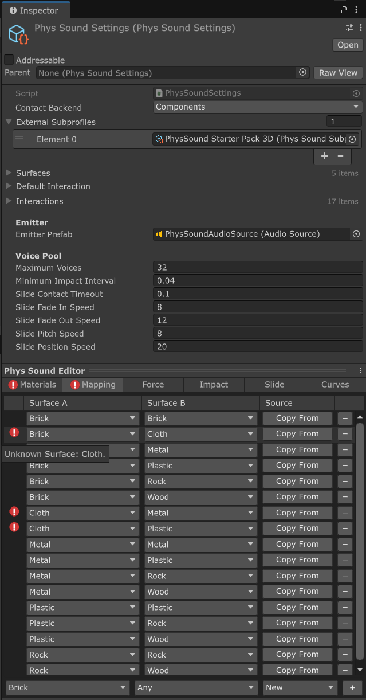
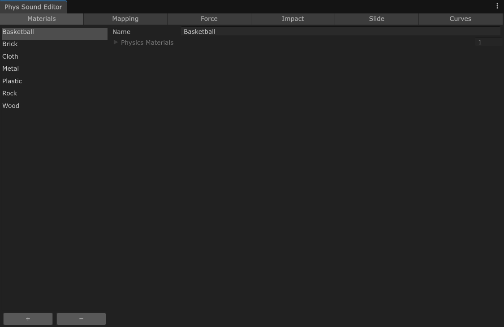
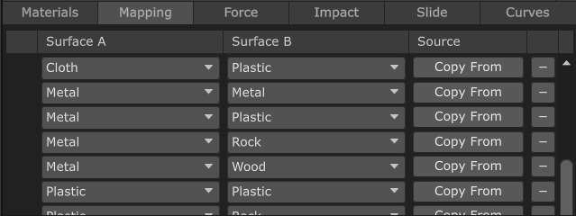
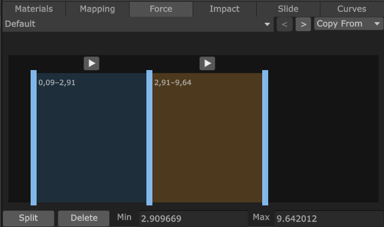
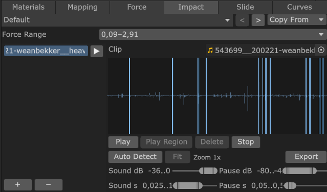
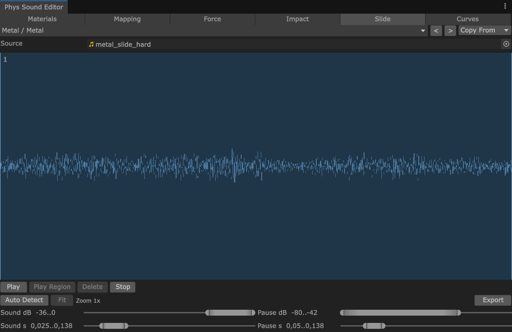
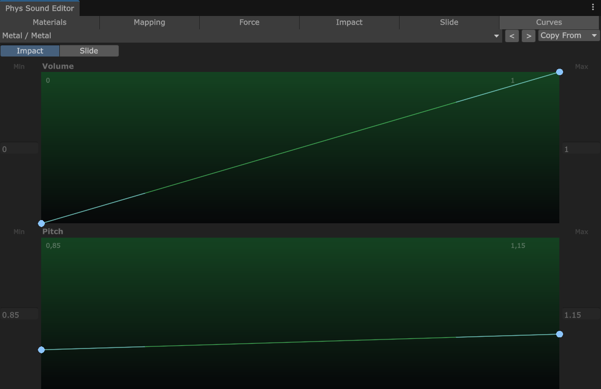

# Phys Sound 2

Phys Sound turns Unity 3D and 2D collision contacts into positioned impact and sliding audio. Version 2.0 is a breaking rewrite for Unity 6000.6.0a7 and newer, built around one settings asset and a bounded pool of native spatial `AudioSource` objects.



| Field | Description |
| --- | --- |
| **Contact Backend** | Selects the Physics 3D integration. **Provides Contacts** requires enabling the standard **Provides Contacts** flag on participating colliders, but no `PhysSoundObject` component is needed. **Components** requires `PhysSoundObject` on the root that receives collision callbacks, normally the `Rigidbody` GameObject. This setting does not affect Physics 2D, which always uses `PhysSoundObject`. |
| **External Subprofiles** | Extends the main settings in array order. A later subprofile overrides matching surfaces and interactions from the main settings or earlier subprofiles. The **Default Interaction** always belongs to the main settings. |
| **Surfaces** | Named groups of `PhysicsMaterial` and `PhysicsMaterial2D`, edited in [Materials](#materials). |
| **Default Interaction** | Final fallback when no exact or `Any` mapping from [Mapping](#mapping) matches the contacting surfaces. |
| **Interactions** | Impact and slide settings for surface pairs, edited in [Mapping](#mapping), [Force](#force), [Impact](#impact), [Slide](#slide), and [Curves](#curves). |
| **Emitter Prefab** | `AudioSource` template used by every pooled voice. Configure spatial audio and mixer routing on this prefab. |
| **Maximum Voices** | Maximum number of pooled impact and slide voices that can play at once. |
| **Minimum Impact Interval** | Minimum time in seconds between impact sounds from the same collider pair. |
| **Slide Contact Timeout** | Time in seconds without a contact update before a slide starts fading out. |
| **Slide Fade In Speed** | How quickly slide volume approaches a higher target volume. |
| **Slide Fade Out Speed** | How quickly slide volume approaches a lower target volume. |
| **Slide Pitch Speed** | How quickly slide pitch follows its target value. |
| **Slide Position Speed** | How quickly the slide emitter follows the current contact position. |

## Requirements

- Unity 6000.6.0a7 or newer
- Unity Audio and Physics 3D modules
- Physics 2D module only for 2D contacts

## Installation

Install the Git URL through Unity Package Manager:

```text
https://github.com/mitay-walle/com.mitay-walle.phys-sound.git
```

Then:

1. Open **Edit > Project Settings > Audio > Phys Sound**.
2. Press **Create Settings**.
3. Import a package sample from the **Samples** tab in Package Manager, or configure your own surfaces and interactions.
4. Choose a contact backend for Physics 3D.

The settings asset and `AudioSource` prefab are created under `Assets/Resources/PhysSound`.

## Step by Step Setup

### Preview Tabs

Select the settings asset or a `PhysSoundSubprofile` to use the editor at the bottom of the Inspector.

#### Materials

Create named surfaces and assign their `PhysicsMaterial` or `PhysicsMaterial2D`. Colliders with a null material or a material not added to **Materials** use `Default`.



#### Mapping

Map surface pairs to interactions.

- `Default` is used when a collider's Physics Material is null or not added to **Materials**.
- `Any` is a wildcard. For example, `Metal + Any` matches Metal contacting any other surface.

Resolution order is exact pair, either surface paired with `Any`, then **Default Interaction**. **Copy From** replaces the selected interaction with an independent copy of another interaction.



#### Force

Split the impact-force axis into ranges. An impact selects the range containing its impulse, then randomly chooses one marked region or clip from that range. The ▶ button auditions the selected range using its midpoint force.



#### Impact

Add source clips for the selected force range and mark one or more waveform regions. At runtime, every marked region participates in random selection as a separate impact clip without requiring the source audio to be split manually. **Export** is supported and writes every marked region to a separate WAV file.



#### Slide

Assign a source clip and mark the single loop region used for continuous sliding. **Export** is supported and writes the marked region as a `Slide_Loop` WAV file.



#### Preview playback

- The ▶ button beside an impact source plays a random marked region, or the full clip when it has no regions.
- The ▶ button above a force range plays a random configured impact result from that range.
- **Play** plays a random marked region, or the full source when no region is marked.
- **Play Region** plays only the currently selected region.
- **Stop** stops editor preview playback.

Waveform editing supports zoom, pan, manual region marking, automatic region detection, and WAV export.

#### Curves

Choose **Impact** or **Slide**, then edit its **Volume** and **Pitch** response. Each curve always has two points: the left point is the response at the interaction's minimum impulse or slide speed, and the right point is the response at its maximum.

Drag vertically to change a point's Y value. Drag horizontally to change that point's tangent and therefore the bend between the two endpoints; the points remain fixed at the minimum and maximum X positions. The numeric **Min** and **Max** fields set the exact Y values of the left and right points. Volume is limited to `0–1`, while pitch is limited to `0.1–3`.



Enable **Force Disable Physics 2D** in the settings when the package should omit its 2D runtime code.

## Audio and samples

Configure mixer routing, spatial blend, rolloff, distance, Doppler, spread, priority, and reverb on the referenced `AudioSource` prefab.

The package includes Example Scene and Starter Pack samples for both 3D and 2D.

## Migrating from 1.x

Phys Sound 2.0 is not API-compatible with 1.x. Reconfigure existing content through **Project Settings > Audio > Phys Sound**. The old `PhysSoundObject` script GUID is retained so existing components do not become missing scripts.

## License

Phys Sound is distributed under the MIT License. The original PhysSound system was developed by Kevin Somers (`crazymonkey`).
